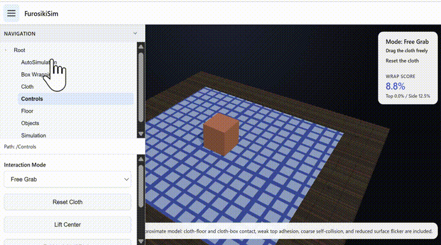

# FurosikiSim

## Overview
FurosikiSim is a browser-based cloth folding and box wrapping simulator with simple 3D physics, a ParamUI-based control panel, and a macro-driven auto simulation mode.

## Quick Start
https://covao.github.io/FurosikiSim/FurosikiSim.html

Keep `FurosikiSim.html` and `paramui.js` in the same folder, then open `FurosikiSim.html` in a modern browser. You can also publish both files with GitHub Pages.

## Features
- Real-time cloth interaction in a 3D view
- Multiple grab modes for folding and lifting
- Box placement, selection, resize, and deletion
- Box wrapping action for wrapping cloth around a box
- Adjustable cloth parameters such as mesh resolution, weight, bendability, stretchability, and friction
- Adjustable floor friction and floor texture
- ParamUI-based control panel for editing parameters from a structured UI
- AutoSimulation group with repeat count, start, and stop controls
- Macro-driven automation using `paramui.js` to randomize parameters, wrap the cloth, reset the scene, and repeat
- Improved slider styling so the slider bar remains visible against the panel background

## Requirements
- A modern web browser
- WebGL enabled
- Recommended: latest Chrome, Edge, Firefox, or Safari

## Usage
Open `FurosikiSim.html` in your browser to start the simulator. The ParamUI panel contains the simulation controls grouped by category.

### Manual Simulation
Use the `Controls`, `Objects`, `Box Wrapping`, `Cloth`, and `Floor` groups to interactively configure the scene. Drag the cloth or a selected box directly in the 3D view.

### Auto Simulation
Open the `AutoSimulation` group in the ParamUI panel.

1. Set `Repeat Count`.
2. Press `Auto Simulation`.
3. Press `Stop` to interrupt the sequence at any time.

Each cycle uses the ParamUI macro runner in `paramui.js` to:
- randomize box size and wrapping parameters
- randomize selected cloth and floor parameters
- execute the wrap action
- reset the cloth
- repeat for the specified count

The stop request is checked during waits and between macro steps, so the simulation stops more responsively than a per-cycle stop.
